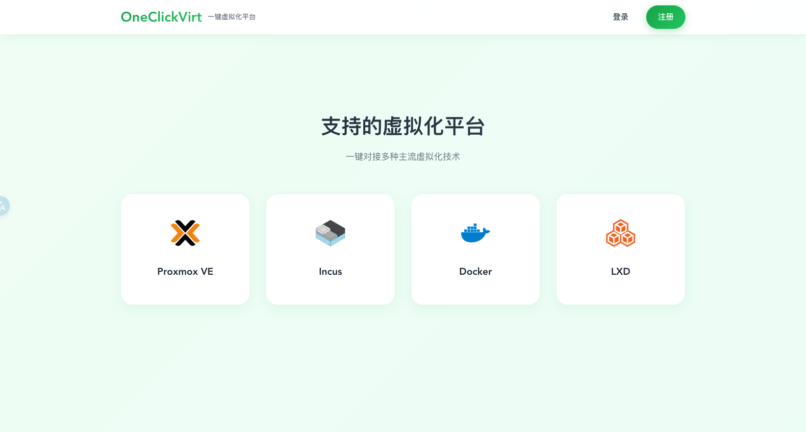
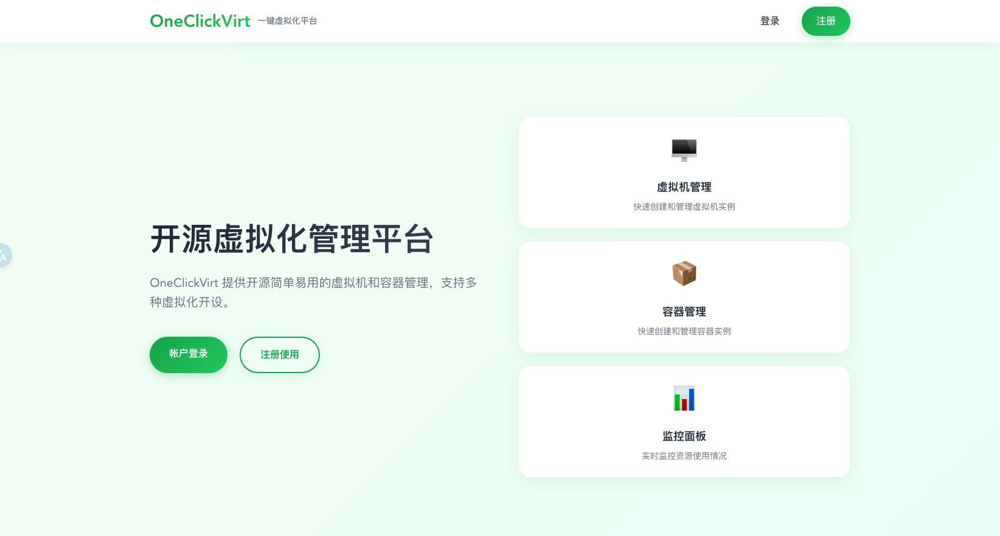
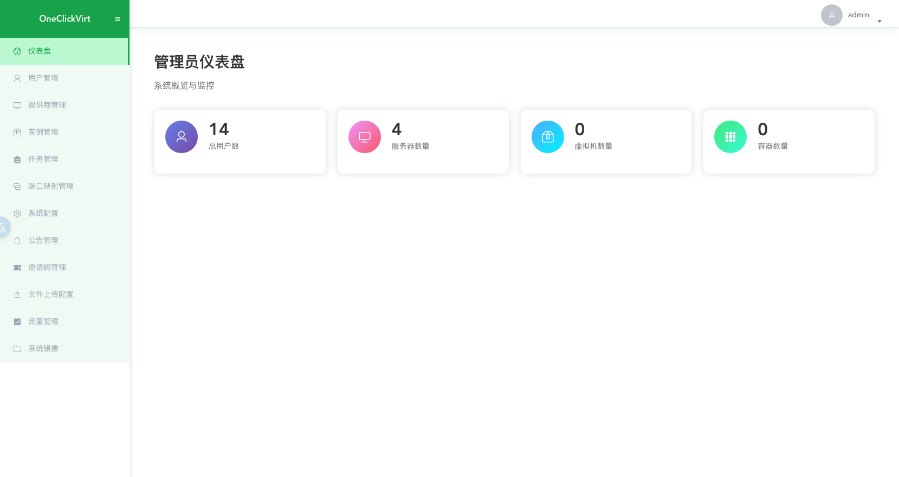
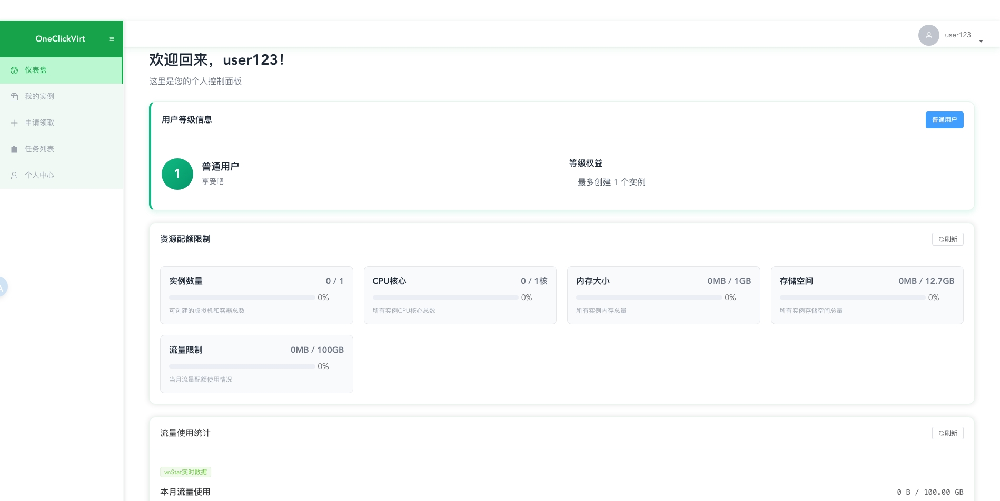
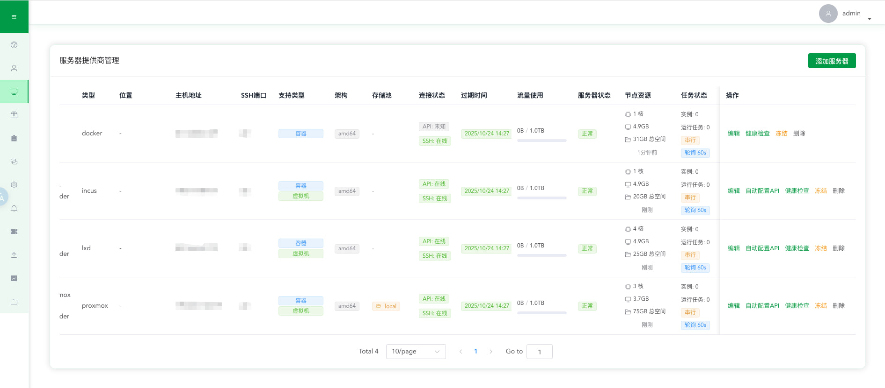
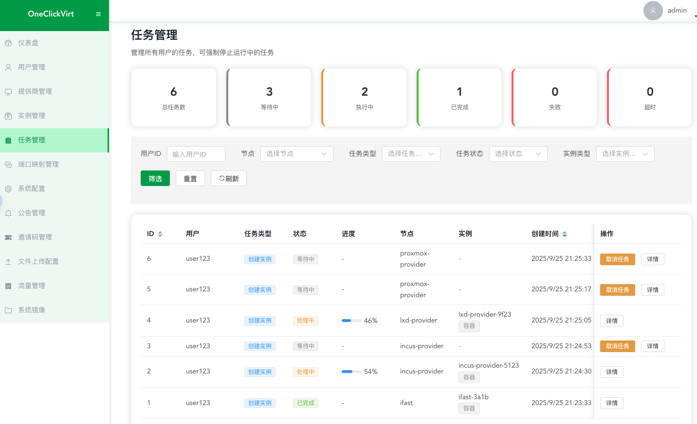
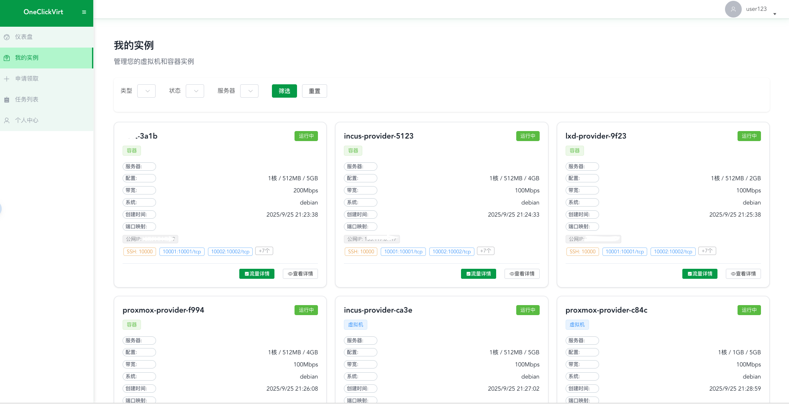

# OneClickVirt 虚拟化管理平台

一个可扩展的通用虚拟化管理平台，支持 LXD、Incus、Docker 和 Proxmox VE。

## 详细说明

[www.spiritlhl.net](https://www.spiritlhl.net/)

## 快速部署

### 方式一：Docker 一键部署

```bash
git clone https://github.com/oneclickvirt/oneclickvirt.git
cd oneclickvirt
```

```bash
# 构建镜像
docker build -t oneclickvirt .
```

```bash
# 启动容器
docker run -d \
  --name oneclickvirt \
  -p 80:80 \
  -v oneclickvirt-data:/var/lib/mysql \
  -v oneclickvirt-storage:/app/storage \
  --restart unless-stopped \
  oneclickvirt
```

### 方式二：手动开发部署

#### 环境要求

* Go 1.24.5
* Node.js 22+
* MySQL 8.0+
* npm 或 yarn

#### 环境部署

1. 构建前端
```bash
cd web
npm i
npm run serve
```

2. 构建后端
```bash
cd server
go mod tidy
go run main.go
```

3. 开发模式下不需要反代后端，vite已自带后端代理请求。

5. 在mysql中创建一个空的数据库```oneclickvirt```，记录对应的账户和密码。

6. 访问前端地址，自动跳转到初始化界面，填写数据库信息和相关信息，点击初始化。

7. 完成初始化后会自动跳转到首页，可以开始开发测试了。

#### 本地开发

* 前端：[http://localhost:8080](http://localhost:8080)
* 后端 API：[http://localhost:8888](http://localhost:8888)
* API 文档：[http://localhost:8888/swagger/index.html](http://localhost:8888/swagger/index.html)

## 默认账户

系统初始化后会生成以下默认账户：

* 管理员账户：`admin / Admin123!@#`
* 普通用户：`testuser / TestUser123!@#`

> 提示：请在首次登录后立即修改默认密码。

## 配置文件

主要配置文件位于 `server/config.yaml`

## 演示截图







